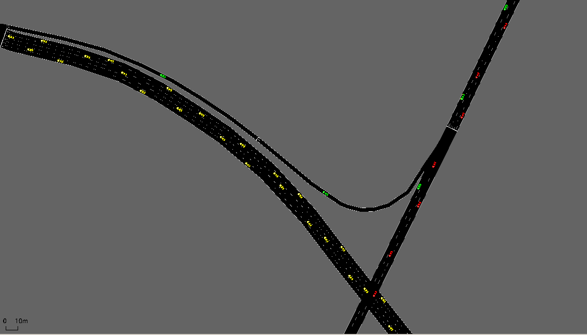
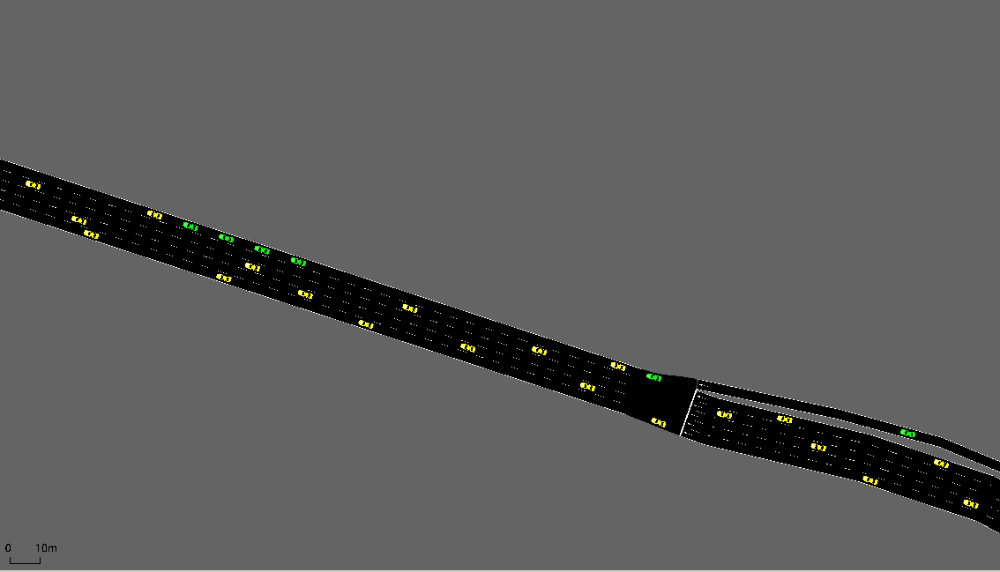
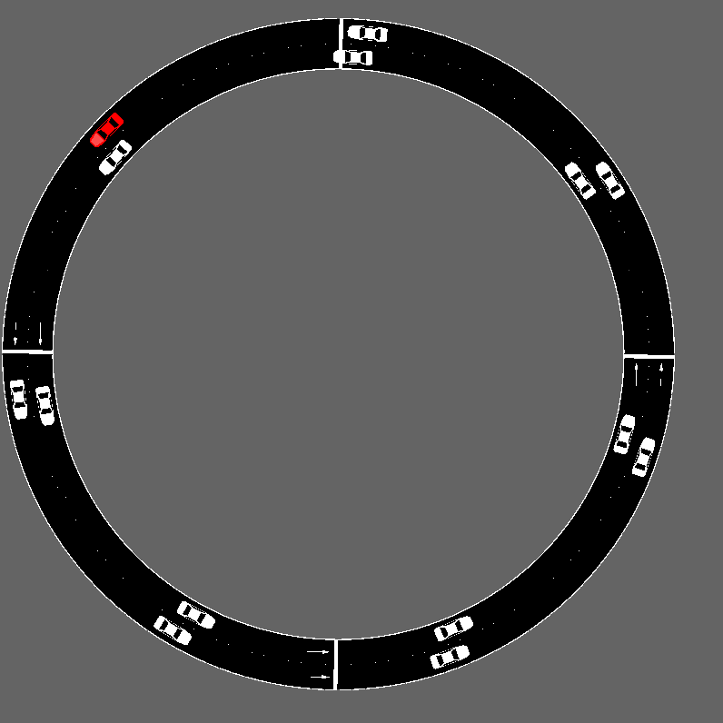
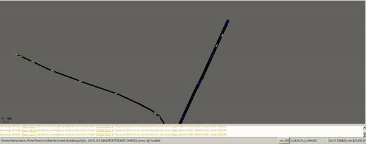
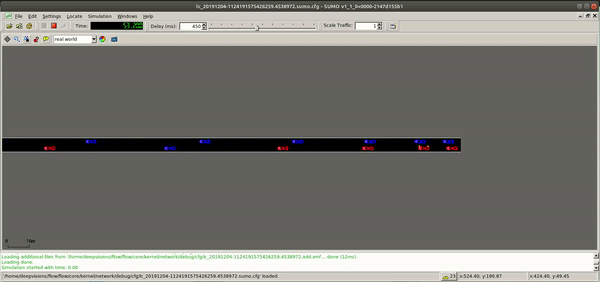
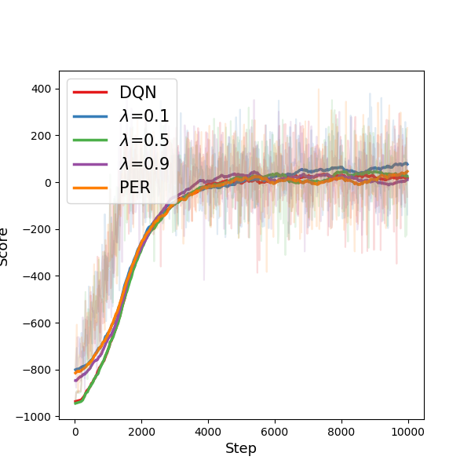
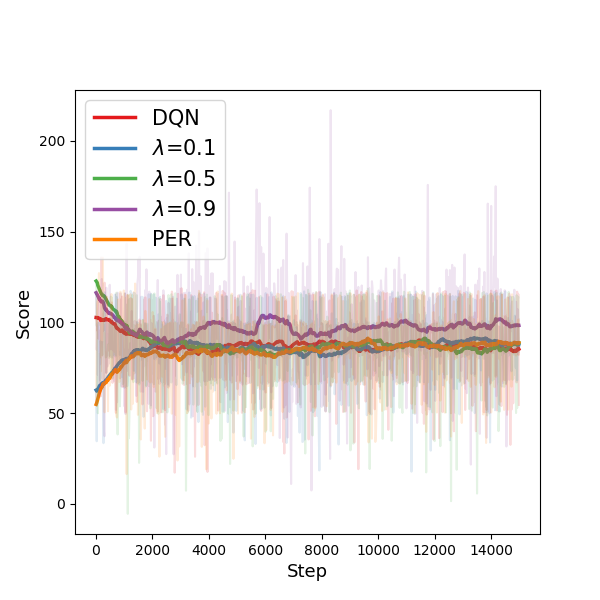

# Double Experience Replay (DER)

<b>Pytorch implementaion of Double_Experience_Replay (DER)</b>

This method mixes two stratesgies for sampling experiences which will be stored in replay buffer.\
You could choose strategies whatever you want, but this paper we use temperal difference (TD) value based sample strategy and uniform sample strategy.


# Contents
This implementaion contains:

<b>Simulation of Urban MObility (SUMO) </b>
* Lane change Environmnet
* Ring Network Environment

**YeongDong Bridge Environment does not supported.

<p float="left">
  
   
   
</p>

# Method

Using Uniform sample strategy and TD value based sampling method. \
As a training algorithm we use Deep Q-learning (DQN)

# Requirements
* [Pytorch](https://pytorch.org)
* [Flow](https://flow-project.github.io/)
* Numpy
* [Gym](http://gym.openai.com/)
* TensorboardX


# Usage

To train SUMO with ring environment
```
cd ring
python ring.py
```

To train SUMO with Lane Change environment
```
cd lanechange
python lane.py
```

# Result

YeongDong Bridge Agent (LEFT, white car) Lane Change Agent (RIGHT, white car)
<p float="left">
  
   
</p>

YeongDong Bridge (DQN, DER, PER)     Ring Network (DQN, DER, PER)

<p float="left">
  
   
</p>

